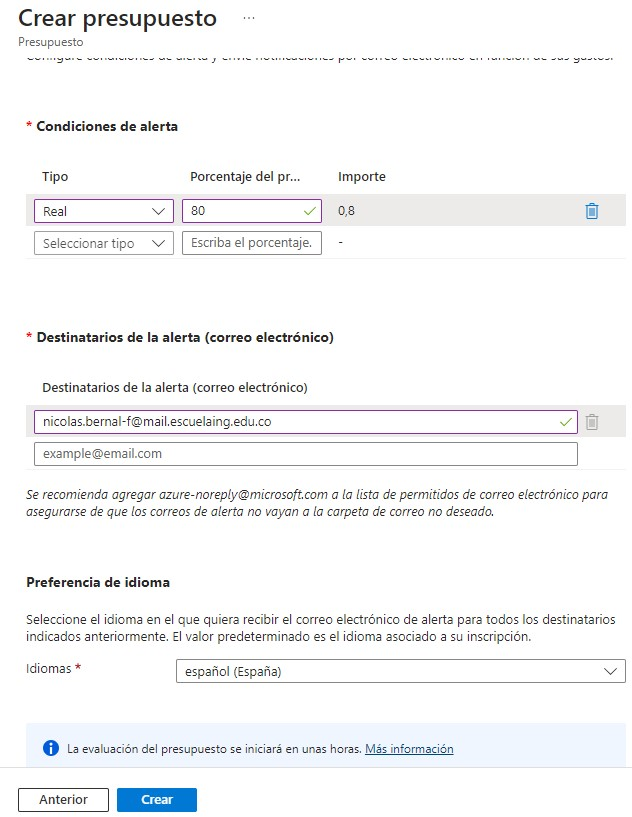

# Despliega mi primera aplicación en Azure

## Nicolas Bernal

## Mi primer despliegue en la nube

# Parte I - Despliegue app React (frontend) en Azure

1) Busca Azure for Students en tu buscador de preferencias e ingresa con el correo institucional.


2) Crea un budget de 1 dólar para la cuenta





3) El profesor guía el resto de pasos

Primero creamos un grupo de recursos.


Ahora, dentro de ese grupo de recursos vamos a crear una aplicacion web estatica en donde vamos a alojar la aplicacion de la calculadora del laboratorio pasado.


Luego de hacer todo el proceso vamos a ver que la aplicacion web estatica quedo lista con nuestra calculadora.


# Parte II - Despliegue app web spring MVC (o spring-boot backend)
1) Inicie [Azure Cloud Shell](https://docs.microsoft.com/en-in/azure/cloud-shell/overview) desde el portal. Para implementar en un grupo de recursos, ingrese el siguiente comando
```shell
az group create --name MyResourceGroup --location westus
```
2) Para crear un plan de servicio de aplicaciones (App service plan)
```shell
az appservice plan create --resource-group MyResourceGroup --name MyPlan --sku F1
```
3) Finalmente, cree el servidor MySQL con un nombre de servidor único.
```shell
az mysql flexible-server create --resource-group MyResourceGroup --name mysqldbserver --admin-user mysqldbuser --admin-password P2ssw0rd@123 --sku-name B_Standard_B1ms
```
> Importante: Introduzca un nombre de servidor SQL único. Dado que el nombre de Azure SQL Server no admite las convenciones de nomenclatura de mayúsculas y minúsculas UPPER / Camel , utilice minúsculas para el valor del campo Nombre del servidor de base de datos. 
4) Navegue hasta el grupo de recursos que ha creado. Debería ver un servidor **Azure Database for MySQL server** aprovisionado. Seleccione el servidor de base de datos.


5) Seleccione **Properties**. Guarde el **Server name** y el **Server admin login name** en un bloc de notas.


> En este ejemplo, el nombre del servidor es myshuttle-1-mysqldbserver.mysql.database.azure.com y el nombre de usuario administrador es mysqldbuser@myshuttle-1-mysqldbserver.
6) Seleccione **Connection security**. Habilite la opción **Allow access to Azure services** y guarde los cambios. Esto proporciona acceso a los servicios de Azure para todas las bases de datos de su servidor MySQL.

## Ejercicio 2: actualización de la configuración de la aplicación web
A continuación, navegue hasta la aplicación web que ha creado. Mientras implementa una aplicación Java, debe cambiar el contenedor web de la aplicación web a Apache Tomcat.
1) Seleccione **Configuration**. Establezca **Stack settings** como se muestra en la imagen a continuación y haga clic en Guardar.


2) Seleccione Overview y click en Browse.


3) La página web se verá como la imagen de abajo.


A continuación, debe actualizar las cadenas de conexión para que la aplicación web se conecte correctamente a la base de datos. Hay varias formas de hacerlo, pero para los fines de esta práctica de laboratorio, adoptará un enfoque simple actualizándolo directamente en Azure Portal.

4) Desde Azure Portal, seleccione la aplicación web que aprovisionó. Ir a Configuración | Configuración de la aplicación | Cadenas de conexión y haga clic en + Nueva cadena de conexión.


5) En la ventana Agregar/Editar cadena de conexión, agregue una nueva cadena de conexión MySQL con MyDatabase como nombre, pegue la siguiente cadena para el valor y reemplace MySQL Server Name, su nombre de usuario y su contraseña con los valores apropiados. Haga clic en Actualizar.
```java
jdbc:mysql://{MySQL Server Name}:3306/alm?useSSL=true&requireSSL=false&autoReconnect=true&user={your user name}&password={your password}
```


- Nombre del servidor MySQL: Valor que copió previamente de las Propiedades del servidor MySQL.
- su nombre de usuario: Valor que copió previamente de las Propiedades del servidor MySQL.
- su contraseña: valor que proporcionó durante la creación del servidor de base de datos MySQL.

7) Haga clic en Guardar para guardar la cadena de conexión.
> Nota: Las cadenas de conexión configuradas aquí estarán disponibles como variables de entorno, con el prefijo del tipo de conexión para aplicaciones Java (también para aplicaciones PHP, Python y Node). En el archivo DataAccess.java en la carpeta src/main/java/com/microsoft/example, recuperamos la cadena de conexión usando el siguiente código
```java
String conStr = System.getenv("MYSQLCONNSTR_MyDatabase");
```
Ahora ha instalado y configurado todos los recursos necesarios para implementar y ejecutar la aplicación MyApplication.

## Ejercicio 3: implementar los cambios en la aplicación web
1) Conectate con un cliente FTP y sube el jar de la aplicación Java https://github.com/PDSW-ECI/spring-mvc-with-bootstrap

## Entrega
- El enlace de la aplicación React y Spring MVC desplegada en Azure
